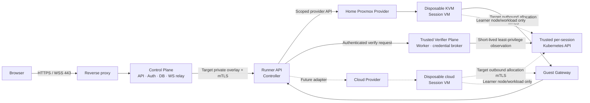
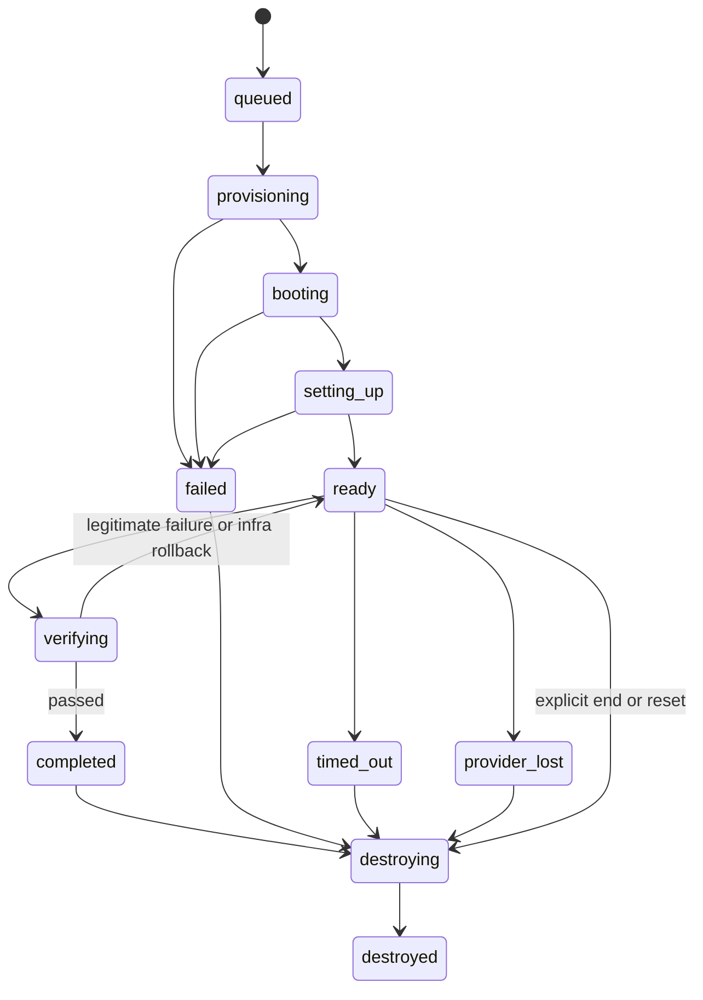

# Runner Platform Architecture

Status: accepted design baseline; provider deployment and live isolation evidence pending.

## Decision

k8s-quiz will treat session execution as a provider-neutral Runner platform.
The first public-capable provider is disposable KVM VMs on a home Proxmox server.
The existing Docker implementation remains a local-development adapter only.
A future cloud provider implements the same contract and conformance suite.

The home server is a valid starting point because the required security property is
a separate kernel and denied management reachability—not a cloud brand. One physical
home server is still one availability and capacity failure domain, which the product
handles with a queue and explicit operating limits.

The public Runner host is not a general-purpose personal server: it must not also host
NAS data, router/home-automation control, credential vaults, or unrelated critical
workloads. Moving the Control Plane to a small VPS later further reduces this shared-
host blast radius without changing the Runner contract.

## Architecture



The browser never connects directly to a Session VM, Guest Gateway, Runner API, or
Proxmox. Terminal traffic follows:

```text
Browser WebSocket -> Control Plane relay -> Runner terminal stream
  -> Guest Gateway -> allocation-bound guest PTY
```

## Trust boundaries

| Boundary | Rule |
| --- | --- |
| Internet → Control Plane | HTTPS/WSS only; auth, CSRF/origin, body/frame, rate and connection limits |
| Control Plane → Runner | public-provider target: private network/overlay plus mTLS; typed domain operations only |
| Runner → Proxmox/cloud | provider credentials scoped to dedicated resources; never available to guest or browser |
| Runner → guest | one-time bootstrap then short-lived allocation certificate; guest is untrusted |
| Runner → trusted verifier | authenticated exact-subject request; digest-pinned worker/artifact; no browser-selected execution input |
| Verifier → trusted session API | short-lived allocation/generation credential and exact API-only egress; credential and API authority unavailable to learner root |
| Session → verifier | default deny; guest output, exit status, tools, and API claims never authorize a grade |
| Session VM → networks | deny management, service/DB, home LAN, other sessions, metadata/control; allow only required gateway/DNS/registry/egress policy |
| Problem content → execution | approved immutable revision; Runner resolves templates/scripts/images from trusted catalogs |

Session root is expected inside its VM. It must not imply root or provider authority
outside that VM. This platform is a learning service, not a tamper-proof examination
environment against a learner who controls guest root. It must still prevent that
root user from forging an ordinary product grade. KVM host isolation alone does not
provide grading integrity: public verification also requires a trusted observation
path that excludes the learner-owned OS and learner-owned Kubernetes API. ADR 001 is
the public acceptance gate for that topology.

## Runner contract

The authoritative public contract is represented by this document and the
provider-neutral interfaces in `runnerprotocol/`. The current in-process
`Runner` interface implements:

- `CreateSession`
- `WaitReady`
- `SetupSession`
- `GetSession`
- `OpenTerminal`
- `VerifySession`
- `DestroySession`
- `Reconcile`

`Reconcile` now defaults to typed `report_only` behavior. Local Docker apply is
authorized only by an exact controller-fenced durable snapshot whose catalog
selection and resource profile can reconstruct the approved immutable create
spec, plus complete ownership evidence and exact physical IDs for each
deterministic allocation. It no longer performs a provider/scope label sweep.
Validation, runtime resolution, and inventory preflight cover the complete batch
before mutation; any ambiguity there causes zero DELETE calls. Docker cannot
atomically delete a multi-allocation batch, so an apply-time failure may leave
partial exact cleanup for the next retry. Startup records durable absence only
after reconciliation returns one matching absence proof for every snapshotted
allocation: either it was already absent, or exact-owned removal completed and
post-delete inventory proved both exact IDs and deterministic names absent.
Ambiguous, incomplete, duplicate, unexpected, partial, or manual-review results
keep admission closed and leave the complete PostgreSQL snapshot unchanged.

This is a bounded development-provider safety slice, not the final public
reconciler. Full provider inventory for untracked orphans, canonical external
IDs and duplicate quarantine, expiry findings, persisted VM/disk/NIC/credential
evidence, and the shared Proxmox/cloud conformance suite remain public-service
acceptance gates.

The public-provider target additionally requires replayable `WatchEvents` and
advisory `GetCapacity`; neither is a method of the current interface. The sibling
private infra repository now contains an in-process TLS 1.3 mTLS `privateapi/v1`
PoC for only `ActivateController`, `Create`, `Get`, and `Destroy`. It uses strict
redacted DTOs and a durable PostgreSQL-backed Proxmox Store. A non-root `scratch`
disabled listener now exercises certificate loading plus Store and validator
security preflight, then returns `PROVIDER_UNAVAILABLE` for every lifecycle call.
Its command is fixed to exactly 25 flags and eight distinct read-only bind-secret
files. The Runner Store and Control Plane validator use separate database CA sets;
each URL must name its exact mounted `sslrootcert` with `sslmode=verify-full`, and
there is no system-root fallback. Its default-deny infra build context is bound to
an exact 31-file SHA-256 inventory, the public protocol has a separate exact source
manifest, and the Linux builder runs the actual target tests. Its production and
test dependency graphs are exact-allowlisted and contain neither the Proxmox
provider package nor its private-API adapter. The final `scratch` image contains
only the listener binary and no system CA bundle. Store migration,
hardening, pool hooks and full runtime attestation are owned once by the
provider-neutral `store/postgres` package; the provider receives only an opaque
pool-and-schema-bound attestation capability. Binary symbol denial remains an
additional image check rather than the primary package-boundary proof.
It is not a deployable full Runner transport: there is no operational provider
backend, cross-host private overlay, Guest Gateway, setup, terminal, verify,
event watch or capacity API. The private infra repository now contains a
hardware-free scoped Proxmox HTTP/UPID client PoC, but it is not wired into this
listener and has no durable external-task evidence across restart or response loss.

The Control Plane now has a deliberately narrower `PrivateVMLifecycle` adapter for
those four VM-only calls. It binds the live controller fence and exact allocation,
catalog, revision, profile, expiry, and operation identity, preserves ambiguous
mutation outcomes, and rejects semantically mismatched success responses. It does
not implement `Runner`, so VM running cannot be mistaken for guest readiness and
VM absence cannot be mistaken for full disk/NIC/firewall/credential absence. It is
not selected by `main` and does not open `home-proxmox` public configuration.

Inputs identify a validated session, generation, user, approved problem revision,
resource profile, expiry, and idempotency key. They never contain arbitrary images,
commands, scripts, mounts, privilege, networks, environment variables, Proxmox fields,
or cloud fields.

All operations bind to `session_id + generation`. Reset creates a new generation;
stale operations and events cannot mutate it. Create/destroy/verify retries reuse an
idempotency key. Events are persisted and replayed by monotonically increasing
sequence, so frontend state is not dependent on WebSocket timing.

Terminal takeover is a two-phase target contract. After opening a provider lease, the
Control Plane revalidates authority and sends an unpredictable candidate-scoped
`terminal_attached.attach_nonce`; the browser must return exact `terminal_ready`, and
all input/resize frames echo the nonce. Pre-ready frames are discarded in receive
order. Only after ready and a final authority check may the Hub irreversibly
compare-and-swap ownership and close the old tab. The final check and Hub CAS are
linearized against reset/end/timeout/verify by a short per-user session-transition
commit lease. Therefore only precommit failures promise to preserve the old owner.
JWT expiry closes the socket; reconnect first passes through the shared refresh/auth
probe. This relay contract is implemented and race-tested, but it is not accepted
public-runtime evidence for the still-missing private Runner transport and VM boundary.

Verify operation keys are scoped to the authenticated user and request-hashed with
the exact session, generation, allocation, and provider. PostgreSQL returns a typed
`execute`, `resume`, `grade_replay`, or `infrastructure_replay` decision. Only
`execute` authorizes a provider call; `resume` is an already-running/busy observation.
A terminal
grade or infrastructure result is never sent to the provider again under the same
key; a new user verification uses a new key. Ambiguous commits are reconciled by
reading that exact operation, and an interrupted verify on controller restart becomes
a safe terminal infrastructure replay rather than speculative provider execution.

`VerifySession` carries only the exact allocation, problem revision, operation key,
and deadline. Its receipt binds those values to the verifier artifact, verdict,
evidence digest, assurance, and controller fence. Local Docker may return only the
explicit `development_guest` assurance. Public-capable providers require an
authenticated `trusted_external` receipt from a verifier outside learner control;
receipt typing alone is not authentication and does not open the public gate. The
application refuses to wrap a non-local provider unless it supplies an explicit
cryptographic attestation verifier, but concrete trust keys and a non-local provider
are not implemented in this build. Public feedback is allowlisted, while raw evidence
and diagnostics remain private.

## State and persistence



`completed`, `failed`, and `timed_out` are result states, not retained-resource
states. Every allocation reaches `destroying → destroyed` within a bounded grace.

PostgreSQL becomes the desired-state authority through durable `sessions`,
`runner_allocations`, `runner_operations`, and append-only `session_events`. Provider
observations update allocation observation only; they cannot overwrite a newer
generation or desired state. Provider credentials and private network values remain
deployment secrets/configuration, not domain data.

Published problem authority is likewise append-only: public list/detail and session
admission resolve `problem_catalog_head → problem_catalog_entries → problem_artifacts`
directly. The mutable `problems` table is retained only as an admin/identity
compatibility projection; edits there cannot rewrite a published catalog selection.

A provider-scoped controller lease is paired with a monotonically increasing
PostgreSQL controller epoch. Advisory-lock ownership alone is insufficient:
every durable mutation locks and verifies the current epoch before other lifecycle
rows, and every private provider mutation carries the same fence. A stale controller
cannot commit late DB state or report a late provider success after takeover.

Destroy/reset recovery is DB-driven. Workers claim durable operations with short
lease tokens and `SKIP LOCKED`; expired work is safe to reclaim because exact
generation deletion is idempotent. Reset replacement creation remains pending until
all older allocations are proven absent, then resumes with its original operation
identity even when the HTTP client never retries or the controller restarted.

Start and reset admit at most one running transition per user and keep no in-process
wait queue; a competing request receives HTTP 429 and may retry the same
`Idempotency-Key`. If a background worker already owns reset's old-generation
destroy, reset returns HTTP 202 with the operation-bound replacement snapshot and
`cleanup_pending: true`; this is accepted work, not absence proof. Graceful shutdown
first snapshots every DB-authoritative active allocation and records all
desired-absent intents. Only after that full intent phase does a bounded destroy
pool call the provider, so a deadline cannot omit later allocations from durable
recovery merely because an earlier provider delete was slow.

## Home Proxmox provider

Provider-specific Proxmox implementation details remain outside this public
repository. The public boundary and its security requirements are documented
in this section and in the conformance tests.

- use KVM VMs, not privileged LXC or session Docker containers
- use a dedicated Proxmox resource pool, template, storage scope, session network,
  and least-privilege API token
- start with full on-demand clones; linked clone/pre-warm is a later optimization
- build an immutable template with the approved learner node/runtime, a minimal guest
  agent, and no long-lived secret; the trusted API/control-plane placement remains
  outside learner-root authority
- inject one-time generation-bound bootstrap authority; agent connects outbound
- provision from approved problem/template/image digests
- place Session VMs on a denied-by-default zone separated from management, service,
  home LAN/NAS/router, and other sessions
- enforce and measure vCPU, RAM, writable disk/I/O, TTL, terminal, egress, per-user,
  and global limits
- run reconciliation at startup and periodically under one controller lease

Exact node, storage, bridge/VLAN, subnet, token, DNS, router, and capacity values are
operator facts kept in the private infra repository or secret store.

### Implemented private VM-lifecycle slice

The sibling `k8s-quiz-infra/runner` module currently implements a hardware-free,
VM-only provider slice against a narrow client interface:

- trusted `ProviderPlan` and ownership metadata bound to allocation, session and
  catalog generation, immutable problem/template revision, resource profile and
  expiry;
- clone/configure/start/observe/stop/delete/reconcile logic with exact ownership
  checks and report-only handling for ambiguity;
- TLS 1.3 mutual-authentication PoC with URI SAN/EKU validation, strict bounded JSON,
  stable error mapping and redacted lifecycle DTOs;
- a shared single-use authority-proof protocol that binds provider, live Control
  Plane lease/epoch, operation, exact request digest, effect deadline, issuer and
  audience; the private Runner consumes it through a validator-only PostgreSQL
  function before admitting a mutation;
- PostgreSQL schema v2 for provider authority, mutation claims, session heads,
  allocations, append-only create/destroy operations and append-only recovery
  evidence;
- an additive PostgreSQL security layout with a fixed trusted schema, separate
  owner/migrator/runtime roles, exact column grants, fixed function paths,
  schema-qualified Store SQL, scoped advisory-lock wrappers and strict-role tests;
- a provider-neutral Store package that is the sole owner of migrations,
  hardening and runtime attestation, plus an opaque capability binding a provider
  Store to the exact attested pool and schema;
- a provider-neutral private transport package and separate in-process Proxmox
  adapter, with the disabled listener's production and test dependency graphs
  enforced by an exact allowlist that excludes both provider-effect packages;
- an exact disabled-listener deployment contract with 25 flags, eight distinct
  read-only bind secrets, dedicated non-overlapping database CA sets and exact
  `sslrootcert` binding, enforced by both runtime parsing and Compose policy;
- a default-deny infra build context with an exact 31-file hash inventory, actual
  Linux target tests, and a final binary-only `scratch` rootfs with no system CA;
- process-local activation capability, monotonic epoch fencing, provider advisory
  locking, allocation CAS, commit-ack reconciliation and real PostgreSQL race tests;
- exact create replay remains reachable after the session expiry so an acknowledged-
  lost response can be recovered from the durable idempotency ledger; genuinely new
  expired work is still rejected by the provider before any external effect;
- fail-closed automatic recovery only when PostgreSQL proves that an external effect
  could not have started: expired read-only `get`, or expired `create`/`destroy`
  with no exact provider-scoped operation binding. Operation-present and all current
  `reconcile` claims remain blocked.

This slice is not wired into the Control Plane as `home-proxmox`, and public mode
continues to reject that provider. Lease-bound epoch authenticity is implemented at
the code and PostgreSQL boundary: proofs are issued only from the live Control Plane
lease session and are consumed exactly once by the private Runner through a separate
validator login. PostgreSQL 16 tests cover replay, binding changes, concurrent
consumption, takeover fencing and expiry after row-lock waits, and a strict-credential
cross-repository mTLS E2E covers issue → transport → consume → lifecycle dispatch.
This is not deployment evidence: the Control Plane and private Runner role layouts
have not been applied and restore-rehearsed on operator-owned dedicated clusters, and
certificate/validator secrets have not been deployed. The runtime credentials remain
trusted within their exact application DML allowlists; provider-row isolation is not
hostile-role containment. The scoped HTTP client exercises Proxmox request and UPID
polling shapes with an in-process TLS server, but Provider-owned durable task
journaling and real-host conformance remain open. Disk/NIC/firewall/credential
inventory, network isolation, Guest Gateway and trusted
verification also remain open gates.

The latest local arm64/Linux listener artifact passed the config, rootfs, binary,
symbol, mutation and rejected-backend gates as image ID
`sha256:f28be9bb1a2a40769b1ca4e2479da932afdc16d9ac16c9f2569188683f5d058b` with
binary SHA-256
`826bab4e0fb20f84072c5c92f5ec081629b99dd7bd648652dfdf629814355c8c`.
Those values identify only the tested dirty-working-tree local artifact. They are
not signed provenance, a registry digest, a multi-platform manifest, or permission
to deploy publicly.

## Scheduling and cost

Provider selection for new generations:

1. explicit development mode may use `local-docker`
2. public mode prefers `home-proxmox`
3. when home is full/unhealthy, queue by default
4. `cloud` becomes eligible only after explicit paid-overflow enablement, fresh
   provider health/cost data, and hard monthly/per-session/concurrency budget checks

There is no silent Local Docker fallback and no silent cloud spend. Active sessions
are not live-migrated; a provider change affects only new generations.

## Reconciliation

Reconciliation compares PostgreSQL desired state with provider resources inside the
configured scope and immutable ownership metadata. It is repeatable and handles:

- active allocation with matching resource: observe/adopt
- active allocation with missing resource: `provider_lost`, notify and terminate
- desired-absent allocation with resource: delete and verify every owned part absent
- tagged orphan: quarantine then delete only after ownership proof and grace
- duplicates: retain the recorded external ID and quarantine/delete extras
- expired allocation: force desired absent and destroy
- ambiguous/unscoped resource: report only

Destroy is complete only when VM, writable disk, NIC/network allocation, firewall
state, bootstrap/session credentials, agent/terminal lease, and capacity reservation
are proven absent.

## Repository placement

Public application repository:

- Runner domain interface, state/repositories, scheduler policy, Local Docker adapter,
  Control Plane relay, and conformance tests
- public contract/architecture documentation without private network values

Private `k8s-quiz-infra` repository:

- Proxmox/cloud provider implementation and deployment
- VM template build pipeline, firewall/overlay/reverse-proxy configuration
- environment-specific variables, operational runbooks, monitoring, and backup policy

Secrets stay outside both repositories in the runtime secret store.

## Implementation plan

### Slice 1 — safe seam

- add `backend/internal/runner/` contract and conformance fixture
- implement `LocalDockerRunner` over the existing `container.Manager`
- make the existing session flow depend on Runner without behavior change
- add a public-mode validation that refuses `local-docker`

### Slice 2 — durable generations

- add session/allocation/operation/event migrations and repositories
- replace the process-memory lifecycle authority
- reset through generation increment; reject stale events/operations
- clean resources after success, setup error, verify infra error, timeout, and end
- persist provider setup idempotency (`setup:<allocation_id>`) through controller
  restart so setup success followed by a pre-ready crash cannot apply twice
- persist user-scoped verify admission/results with typed execute/resume/grade/infra
  replay, commit-outcome reconciliation, and safe controller-restart convergence
- enforce one running verify per allocation in PostgreSQL; recovery rejects duplicate
  legacy/corrupt rows atomically instead of repeatedly publishing partial convergence
- move the process-local verify interval into durable admission before enabling
  active-active Control Plane replicas; the single controller lease is the current
  deployment precondition
- maintain the implemented nonced terminal attach/ready, pre-ready ordered discard,
  session-transition commit lease, authority-before-CAS takeover, and JWT-expiry
  socket fencing in the private Runner migration

### Slice 3 — private Runner PoC

- retain the implemented Control Plane VM-only adapter as an incomplete transport
  capability; never wire it as `Runner` or treat VM absence as full cleanup proof
- extend the implemented VM-only mTLS API and durable Proxmox Store into a deployable
  full Runner API; deploy the implemented lease-bound epoch proof and strict DB roles
- replace/version the current combined `Client` with a Provider-owned task flow that
  persists clone target VMID, task intent, UPID, source template revision and
  terminal evidence before state advancement; then wire and live-test the scoped
  HTTP client against Proxmox without automatic resubmission after pre-UPID ambiguity
- implement Guest Gateway, setup, terminal, event and capacity paths
- pass one problem through create→terminal→destroy while preserving the verification
  seam; do not claim public verification from same-guest execution
- implement the ADR 001 trusted API/control-plane topology, verifier worker,
  credential broker, authenticated receipt, and private diagnostic boundary before
  enabling `trusted_external`

### Slice 4 — isolation and recovery

- apply and test network/resource policy
- inject failures at every lifecycle stage
- pass restart, orphan, missing, duplicate, expiry, and repeated-destroy tests

### Slice 5 — product integration

- persistent/replayable stage and terminal behavior
- home-capacity queue and operator capacity controls
- all seven problem normal, broken, and adversarial E2E

### Slice 6 — optional cloud

- select a provider only after measured workload and budget inputs
- implement provider adapter and pass the same conformance/isolation suite
- enable paid overflow only behind hard cost controls

## Acceptance gates

The design gates are tracked in this document. Public runtime gates remain
closed until live evidence proves:

- no Docker socket or session shell on the Control Plane
- separate-kernel KVM Session VM per active allocation
- guest root denied from Proxmox/management, Runner management, Service/DB, home LAN,
  other sessions, and provider metadata/control
- measured CPU, RAM, disk/I/O, TTL, egress, terminal, and concurrency limits
- duplicate create/destroy safety and stale-generation rejection
- bounded cleanup on success, timeout, setup/verify failure, explicit end, and reset
- restart/reconcile leaves zero unowned or orphan VM/disk/network/credential resources
- one normal and one injected-failure lifecycle, then all-problem E2E
- public HTTP/WS rate/admission controls and no blocking Runner security finding
- clean committed source snapshots, signed provenance, SBOM/image signatures and
  deploy-time verification that bind both repositories and every platform image
- native amd64/arm64 listener seccomp tests covering production PostgreSQL TLS
  preflight, mTLS traffic, shutdown and explicit high-risk syscall denial
- production certificate and secret issuance/rotation/revocation plus dedicated
  Control Plane and Runner database TLS/restore rehearsal
- trusted verification runs outside the learner-writable guest and returns only
  structured user-safe results; raw verifier/provider diagnostics are not public data
- the verifier also avoids any Kubernetes API controlled by learner root; external
  `kubectl` against a learner-owned API is not trusted verification
- receipt attestation is cryptographically verified and adversarial guest/API,
  cross-allocation credential, late-result, and secret-leak tests in ADR 001 pass

Until these gates pass, operation is limited to trusted testing; the architecture
document does not itself authorize public traffic.

## Operator decisions still required

- hardware/RAM/storage/IOPS inventory and conservative first concurrency cap
- bridge/VLAN/SDN and router/firewall/CGNAT capabilities
- placement of Control Plane/DB and backup/UPS requirements
- reverse-proxy or outbound-tunnel topology
- accepted egress allowlist/registry strategy
- post-completion grace and queue policy
- future cloud provider and hard budget

These decisions parameterize providers and operations; they do not alter the Runner
contract.
