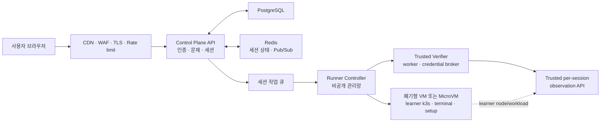

# 공개 서비스 전환 로드맵

> 상태: 구현 진행 중 · 2026-08-01
>
> 목표: 누구나 GitHub 계정으로 가입해 Kubernetes 문제를 풀 수 있는 서비스를 만든다. 사용자가 여는 터미널과 k3s 환경은 서비스 본체나 다른 사용자의 환경을 침해할 수 없어야 한다.

> 현재 판정은 `REDO / PUBLIC BLOCKED`다. 아래에서 완료로 표시한 항목은 코드나
> 로컬 검증 경계만 통과했다는 뜻이며, 공개 배포 허가를 의미하지 않는다.

## 먼저 정할 원칙

현재 구현은 한 사용자의 실습 환경을 Docker의 `privileged` k3s 컨테이너로 실행한다. 이 방식은 개인 개발 서버나 신뢰하는 소수의 데모에는 쓸 수 있지만, 공개 사용자에게 웹 셸을 제공하는 실행 방식으로는 사용할 수 없다.

공개 베타의 최소 조건은 다음 한 줄로 정리한다.

> 사용자 세션은 API 서버와 분리된, 세션마다 폐기되는 VM 또는 MicroVM 안에서 실행한다.

CPU·메모리 제한만으로는 이 조건을 만족하지 못한다. 현재 컨테이너는 `privileged: true`와 host cgroup namespace를 사용한다. Kubernetes도 privileged 워크로드가 일반 격리 장치를 우회하므로 신뢰된 인프라 작업에만 쓰도록 설명한다. [Pod Security Standards](https://kubernetes.io/docs/concepts/security/pod-security-standards/), [kernel-level security constraints](https://kubernetes.io/docs/concepts/security/linux-kernel-security-constraints/)

## 현재 상태와 공개 전 차이

| 항목 | 현재 구현 | 공개 서비스 목표 |
| --- | --- | --- |
| 실습 실행 | 백엔드가 같은 Docker 호스트에 privileged k3s 컨테이너 생성 | Runner가 세션별 VM/MicroVM 생성·폐기 |
| 권한 경계 | 사용자 셸과 서비스 호스트의 경계가 약함 | 사용자 셸은 VM 안에서만 root, 서비스 호스트에는 권한 없음 |
| 네트워크 | 사용자별 Docker bridge, 외부 통신 가능 | 세션별 네트워크와 egress allowlist, 관리망 분리 |
| 세션 상태 | PostgreSQL generation·operation·event 원장과 단일 controller lease 구현 | 다중 인스턴스용 외부 event fan-out·작업 큐와 운영 복구 증거 |
| 용량 제어 | 세션당 1 vCPU·1 GiB, 전역 상한 기본값 0 | 계정·IP·전체 쿼터, 대기열, 비용 한도 |
| 운영 | 로컬 Compose | 홈 Proxmox Runner부터 시작해 TLS, 백업, 모니터링, 배포 자동화, 감사 로그 적용 |

근거 코드:

- [`session.Service.StartProblem`](../backend/internal/session/service.go)은 세션마다 1 vCPU, 1 GiB, `Privileged: true`를 설정한다.
- [`DockerManager.Create`](../backend/internal/container/docker.go)은 privileged 컨테이너와 host cgroup namespace를 생성한다.
- [`docker-compose.yaml`](../docker-compose.yaml)은 현재 백엔드에 Docker socket을 마운트하고 HTTP 포트를 직접 공개한다.

Docker는 daemon 제어 권한을 신뢰된 사용자에게만 줘야 하며, 웹 서버가 Docker API로 컨테이너를 만드는 경우 특히 입력 검증을 엄격히 하라고 안내한다. [Docker Engine security](https://docs.docker.com/engine/security/)

## 목표 아키텍처

### 역할 분리

- **Control Plane**: 로그인, 문제 목록, 세션 예약, 결과 저장, WebSocket 중계만 담당한다. 사용자 셸과 Docker socket에 접근하지 않는다.
- **Runner Controller**: 인증된 내부 요청만 받고, 허용된 문제 ID로 세션 VM을 만든다. 사용자 입력으로 이미지, mount, 환경 변수, 실행 명령을 받지 않는다.
- **Session VM/MicroVM**: k3s와 터미널을 실행한다. 세션이 끝나면 메모리와 디스크를 폐기한다.
- **Trusted Verifier**: learner guest 밖에서 exact allocation/generation/revision을 관찰하고 인증된 receipt만 반환한다. learner root는 verifier 신원·credential과 trusted observation API 권한을 얻을 수 없다. guest 내부 `verify.sh`는 로컬 개발 증거일 뿐 공개 grade의 권위가 아니다.
- **관리망**: Control Plane과 Runner 사이의 mTLS 또는 사설 네트워크다. 인터넷에서 Runner API를 호출할 수 없다.

Firecracker는 컨테이너보다 강화된 워크로드 격리를 목적으로 하는 MicroVM 기술이다. 다만 실제 k3s를 해당 환경에서 안정적으로 기동할 수 있는지 작은 PoC로 먼저 확인해야 한다. [Firecracker 공식 문서](https://firecracker-microvm.github.io/)

## 작업 순서

### P0 — 홈서버에서 신뢰 사용자 대상으로 검증

- [ ] Proxmox 위에 Control Plane VM과 세션용 KVM VM 영역을 분리한다. 세션 VM에는 개인 데이터나 다른 서비스를 두지 않는다.
- [ ] HTTPS 역방향 프록시를 추가하고, 외부에는 443만 연다. 8080, 5173, PostgreSQL, Docker API는 직접 공개하지 않는다.
- [ ] 운영용 `FRONTEND_URL`, 강한 JWT secret, 강한 DB 비밀번호, GitHub OAuth callback URL을 설정한다.
- [ ] 공개 모드 secret은 환경변수 값이 아니라 소유자 전용 regular file과 `*_FILE` 설정으로 주입하고, PostgreSQL은 `sslmode=verify-full`을 사용한다.
- [ ] `MAX_CONCURRENT_SESSIONS=1`로 시작해 CPU·메모리·디스크 사용량을 측정한다.
- [x] Runner 계약과 `LocalDockerRunner` 개발 전용 경계를 만들고 공개 모드에서 Local Docker 선택을 거부한다.
- [ ] 실제 공개 세션을 Proxmox KVM Runner로만 실행하고 Control Plane의 Docker socket을 제거한다.
- [ ] 세션 VM에서 Proxmox 관리망·Control Plane·DB·홈 LAN/NAS/공유기·다른 세션으로 가는 통신을 차단한다.
- [ ] 초기에는 초대된 신뢰 사용자와 낮은 동시 세션 제한으로 수명주기·격리·정리 증거를 수집한다.
- [ ] 운영 환경의 `.env`, 백업, 로그가 Git에 추적되지 않는지 CI에서 검사한다.

P0는 홈서버 배포 연습과 신뢰 베타 단계다. 이 단계가 끝나도 격리·정리
테스트가 P1 기준을 통과하기 전에는 불특정 다수에게 공개하지 않는다.

### P1 — 공개 베타의 차단 조건 해소

- [ ] Docker 기반 사용자 세션을 세션별 VM/MicroVM으로 교체한다.
- [ ] Control Plane에서 Docker socket mount를 제거한다.
- [ ] Runner API를 사설망으로 옮기고 mTLS 또는 workload identity로 인증한다.
- [x] Control Plane lease/epoch와 mutation digest를 묶는 단회성 authority proof를 구현하고 별도 validator DB 역할로 소비한다.
- [x] disabled listener의 runtime/Compose command를 정확한 25개 flag로 고정하고,
  8개의 서로 다른 read-only bind secret, 전용·비공유 DB CA, 각 URL의 정확한
  `sslrootcert`를 fail-closed로 검증한다. 이는 real Runner가 아니라 preflight
  probe의 코드·로컬 artifact 경계다.
- [ ] 세션 VM은 최대 실행 시간, CPU, 메모리, PID, 디스크, 파일 수 제한을 적용한다.
- [ ] 세션 종료·타임아웃·Runner 장애 때 VM과 네트워크를 강제 정리한다.
- [ ] 인터넷 egress를 기본 차단하고, DNS와 허용된 내부 이미지 레지스트리만 연다.
- [ ] 이미지와 문제 의존성은 digest로 고정하고, CI에서 취약점 스캔한다.
- [ ] 두 저장소의 clean commit과 빌드 입력을 이미지 digest에 묶는 signed
  provenance, SBOM, 이미지 서명과 배포 시 검증을 적용한다.
- [ ] native amd64/arm64에서 Runner listener의 seccomp, PostgreSQL TLS
  preflight, mTLS 요청, SIGTERM 종료와 금지 syscall 차단을 검증한다.
- [ ] 운영 인증서·validator credential의 발급, 회전, 폐기와 전용
  PostgreSQL TLS 백업·복구를 리허설한다.
- [x] listener infra build context를 default-deny하고 31개 파일 exact hash
  inventory, 실제 Linux target test, binary-only scratch rootfs 검사를 적용한다.
  현재 local arm64 image/binary hash는 working-tree 증거일 뿐 signed public
  provenance가 아니다.
- [ ] 문제 ID 외의 이미지명·명령·볼륨 경로가 Runner까지 전달되지 않도록 API 계약을 고정한다.

### P2 — 악용과 비용 제어

- [ ] 사용자·IP별 가입, 로그인, 세션 생성, reset, verify, WebSocket 연결 rate limit을 둔다.
- [ ] 무료 사용자 쿼터(일일 세션 수, 동시 세션 수, 누적 실행 시간)와 전역 대기열을 둔다.
- [ ] 봇 가입 방지와 abuse 신고/차단 절차를 마련한다.
- [ ] 세션 수, 큐 대기 시간, VM 생성 실패율, CPU·메모리·egress 비용을 메트릭으로 수집한다.
- [ ] 비용 한도와 알림을 설정한다.
- [ ] 문제 스크립트가 무한 대기·과도한 로그·대량 리소스 생성을 하지 않도록 CI 검증을 추가한다.

요청 횟수뿐 아니라 CPU, 메모리, 네트워크, 저장 공간처럼 비용이 드는 작업의 상한이 필요하다. [OWASP API resource limiting 가이드](https://owasp.org/API-Security/editions/2019/en/0xa4-lack-of-resources-and-rate-limiting/)

### P3 — 다중 인스턴스와 복구

- [x] 활성 세션, generation, Runner 할당, operation, event를 PostgreSQL에 저장한다.
- [ ] WebSocket 이벤트는 Redis Pub/Sub 같은 외부 브로커로 전달한다.
- [ ] 백엔드를 무상태로 만들어 여러 인스턴스로 확장한다.
- [ ] 주기적으로 DB의 세션 상태와 실제 VM 상태를 대조해 orphan VM을 정리한다.
- [ ] PostgreSQL 백업, 복구 리허설, 마이그레이션 롤백 절차를 문서화한다.
- [ ] health check, tracing, 오류 알림, 운영 감사 로그를 추가한다.

### P3.5 — 비용을 통제한 클라우드 전환

- [ ] Control Plane만 먼저 저가 VPS/클라우드로 옮기고 홈 Runner는 사설 overlay+mTLS로 유지할 수 있게 한다.
- [ ] 홈 용량이 부족할 때 기본 동작은 대기열이며, 자동 클라우드 비용 지출이 아님을 보장한다.
- [ ] 클라우드 Runner는 기존 Runner 계약과 동일한 conformance suite를 통과한다.
- [ ] paid overflow는 명시적 활성화, 월 예산, 세션당 상한, 동시 할당 상한이 모두 설정된 경우에만 허용한다.
- [ ] 활성 세션을 live migration하지 않고, 새 generation부터 provider 배치를 바꾼다.

### P4 — 사용자 데이터와 운영 정책

- [ ] 개인정보 처리방침, 서비스 약관, 금지 행위, 계정/기록 삭제 절차를 만든다.
- [ ] 로그인, 관리자 권한 변경, 세션 생성/종료, Runner 오류를 감사 로그로 남긴다.
- [ ] 첫 관리자 계정을 안전하게 bootstrap하는 운영 절차를 만든다.
- [ ] 관리자 기능은 MFA, 최소 권한, 변경 이력으로 보호한다.
- [ ] 의존성 업데이트, SAST, secret scanning, SBOM을 CI에 추가한다.

## 저장소 공개 범위

애플리케이션 코드를 GitHub에 공개하는 것은 문제없고, 보안상 숨겨야 하는 것은 코드가 아니라 **운영 권한과 비밀값**이다. 보안을 위해 코드를 감추는 방식은 의존하지 않는다.

### 공개해도 되는 것

- Control Plane과 frontend·backend 소스 코드
- Dockerfile, 개발용 Compose, CI 설정
- `.env.example`처럼 값이 없는 설정 예시
- 샘플 문제와 데모용 문제 세트
- 아키텍처와 보안 경계 문서

### 절대로 공개 저장소에 넣지 않는 것

- `.env`, 운영용 Compose override, Terraform `*.tfvars`, Kubernetes Secret manifest
- GitHub OAuth client secret, JWT secret, DB 비밀번호, cloud access key, SSH key, registry token
- Runner의 내부 URL, mTLS 개인 키/인증서, VPN 설정, kubeconfig
- 운영 DB dump, 백업, 사용자 이메일·IP·터미널 로그, 모니터링 export

### 별도 비공개 저장소 또는 비밀 관리가 필요한 것

- Runner 배포 설정과 cloud account/IaC의 실제 변수
- production secrets와 인증서
- 공개 랭킹·평가에 쓰는 실제 문제 은행

문제 파일에는 고장 원인과 `verify.sh`의 판정 조건이 들어 있다. 학습용 오픈소스라면 공개해도 괜찮지만, 랭킹의 공정성이나 채용형 평가가 목적이라면 운영 문제 세트는 비공개 repository 또는 내부 registry로 분리한다. 공개 저장소에는 예제 문제만 둔다.

## 공개 베타 시작 조건

아래 항목을 모두 만족할 때에만 불특정 다수에게 URL을 공개한다.

- [ ] 사용자 셸이 Control Plane 또는 Runner 호스트의 root 권한을 얻을 수 없다.
- [ ] 세션별 VM/MicroVM 격리와 폐기 테스트를 통과했다.
- [ ] 모든 public endpoint가 HTTPS이고, 내부 관리 포트는 외부에 열려 있지 않다.
- [ ] 가입·세션·검증·WebSocket에 쿼터와 rate limit이 적용돼 있다.
- [ ] 실행 자원과 비용 한도가 적용되고, 초과 시 자동 차단/알림이 동작한다.
- [ ] 운영 secret, 로그, 백업, 문제 은행의 공개 범위를 점검했다.
- [ ] 장애 시 세션 정리, DB 복구, Runner 장애 대응을 실제로 연습했다.
- [ ] learner 외부 trusted verifier, 인증 receipt, learner-controlled API/credential 공격 시험을 통과했다.
- [ ] clean commit 입력을 signed provenance, SBOM, 이미지 서명과 fresh digest pull에 결합하고 배포 시 검증한다.
- [ ] native amd64/arm64에서 listener seccomp, PostgreSQL TLS, mTLS 요청, SIGTERM 종료와 금지 syscall 차단을 검증했다.
- [ ] 운영 인증서·secret 회전/폐기와 전용 PostgreSQL TLS 백업·복구를 실제로 리허설했다.

## 첫 구현 단위

다음 작업은 P1의 첫 vertical slice로 잡는다.

1. 완료: provider-neutral `Runner` 계약과 generation-bound lifecycle 원장을 구현했다.
2. 완료: `session.Service`를 Runner 경계로 옮기고 Local Docker를 개발 전용으로 제한했다.
3. 완료: VM-only private API의 TLS 1.3 mTLS, 단회성 authority proof, strict DB 역할과 durable Proxmox Store를 구현하고 하드웨어 없는 E2E를 통과했다. Control Plane에는 이를 전체 `Runner`로 가장하지 않는 VM-only 어댑터를 추가했고, private 저장소에는 모든 lifecycle을 거부하는 disabled preflight listener를 추가했다. transport, Proxmox adapter, PostgreSQL 보안 소유권을 분리했으며 listener의 production/test 의존 그래프에는 provider-effect package가 없음을 exact allowlist로 강제한다. 또한 정확한 25개 flag·8개 secret, 전용 DB CA와 exact `sslrootcert`, default-deny 31-file inventory, Linux target test, system CA 없는 binary-only scratch rootfs를 검증한다. 이는 operational Runner나 signed public release가 아니다.
4. 진행 중: dedicated CA·API token, 고정 provider scope와 bounded UPID polling을
   검증하는 hardware-free Proxmox HTTP client PoC를 추가했다. 다음은 현재 결합된
   `Client`를 Provider-owned task flow로 버전업하고 target VMID·UPID·source template
   revision·terminal result를 append-only 원장에 영속화하는 것이다. 그 뒤에만
   Guest Gateway·외부 verifier를 연결해 disposable VM 한 세션의 부팅, 터미널,
   실패/성공 검증, 강제 삭제와 완전한 부재 증거를 만든다.
5. 그 vertical slice와 네트워크 격리 시험이 통과한 뒤에만 공개 베타용 배포 구성을 만든다.
